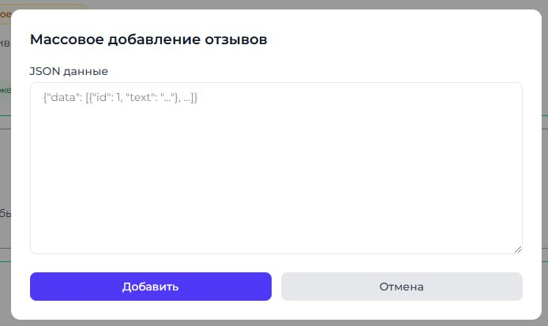
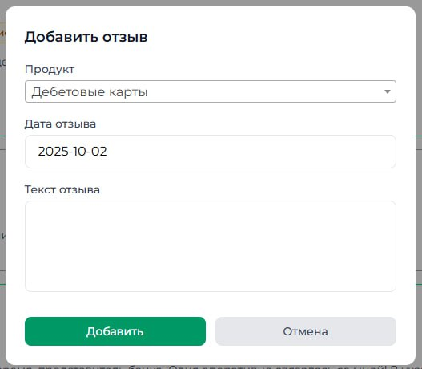
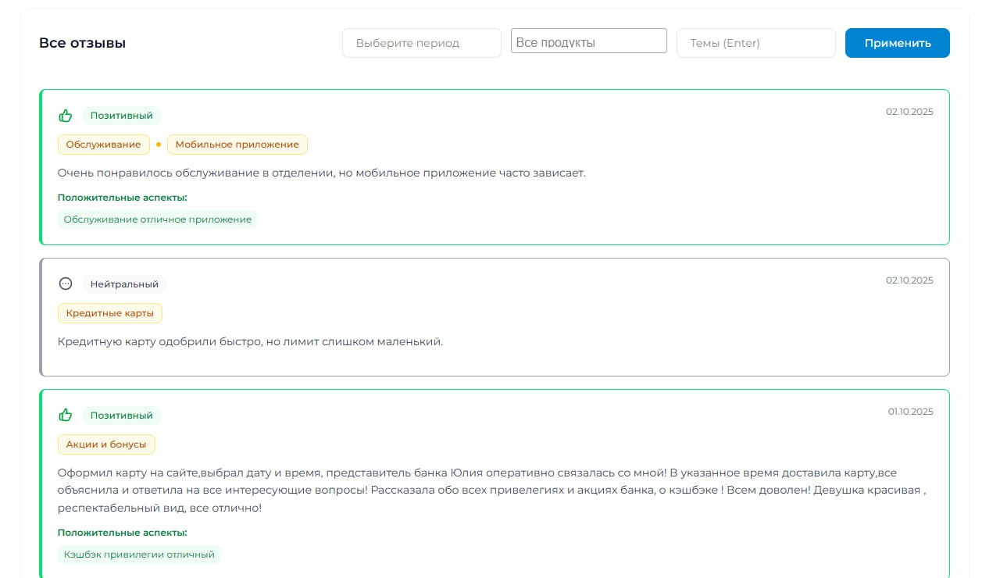
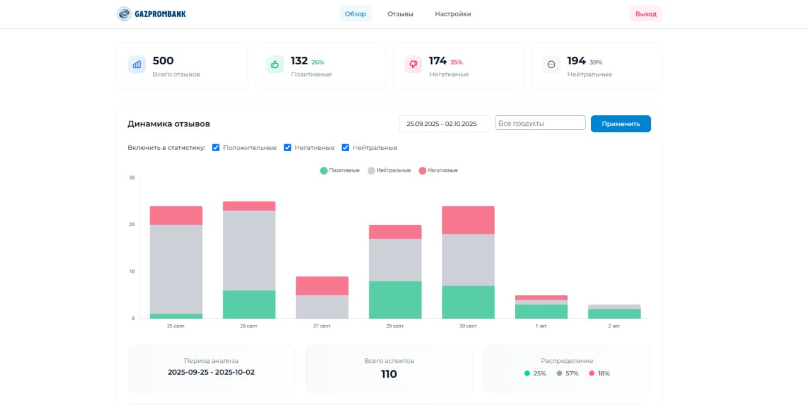
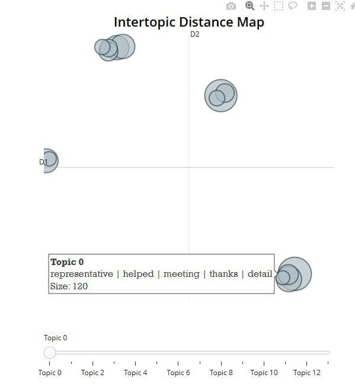
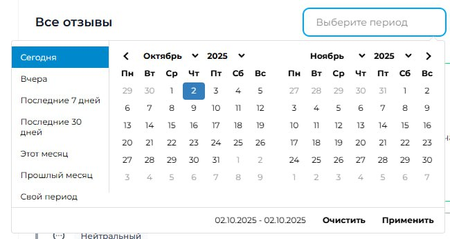
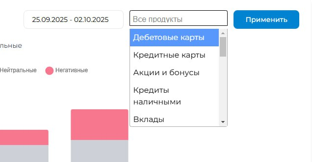
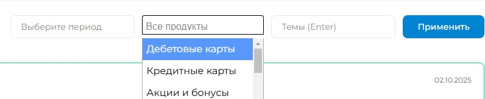
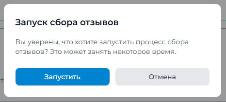

# Инструкция по использованию сервиса анализа отзывов

Все скриншоты находятся в папке [`screens`](./screens) репозитория.

---

## 1. Добавление отзывов

  
*Пример интерфейса для добавления новых отзывов.*

---

## 2. Добавление отдельного отзыва

  
*Форма для добавления одного отзыва вручную.*

---

## 3. Сводка отзывов

  
*Общий список всех отзывов с ключевой информацией.*

---

## 4. Основной дашборд

  
*Главный дашборд с графиками динамики тональности и распределения тем.*

---

## 5. Кластеризация отзывов

  
*Пример визуализации тематических кластеров отзывов.*

---

## 6. Фильтры отзывов

### 6.1. По дате
  
*Фильтрация отзывов по выбранному периоду.*

### 6.2. По продукту
  
*Фильтрация по продуктам.*

### 6.3. Другие фильтры
  
*Дополнительные возможности фильтрации.*

---

## 7. Функции сервиса

  
*Список доступных функций сервиса.*

---

## 8. Начало работы с отзывами

  
*Начало анализа и работы с отзывами.*
